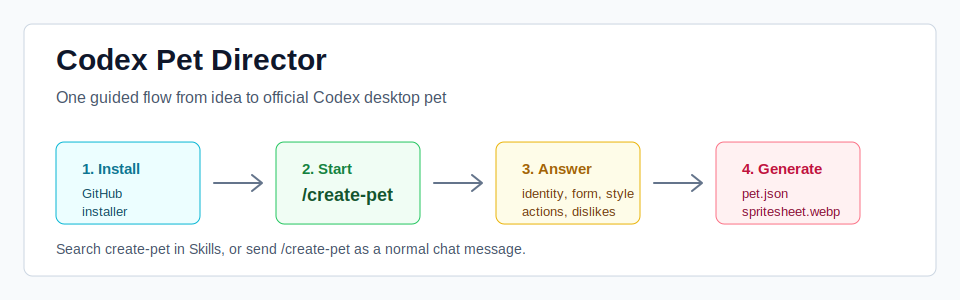

# Codex Pet Director

<p align="center">
  <a href="#简体中文">简体中文</a> ·
  <a href="docs/README.en.md">English</a> ·
  <a href="docs/README.zh-TW.md">繁體中文</a> ·
  <a href="docs/README.ja.md">日本語</a> ·
  <a href="docs/README.ko.md">한국어</a> ·
  <a href="docs/README.es.md">Español</a> ·
  <a href="docs/README.fr.md">Français</a> ·
  <a href="docs/README.de.md">Deutsch</a>
</p>

<p align="center">
  
</p>

## 快速入口

最适合新手的方式：把这句话直接发给 Codex，让 Codex 自己安装。

```text
请使用 skill-installer 安装这个 GitHub skill：https://github.com/zixuanzhou0-ai/codex-pet-director/tree/main/codex-pet-director
```

安装完成后重启 Codex，然后输入：

```text
/create-pet
```

如果你的 Codex 版本支持插件斜杠命令，`/create-pet` 可以作为命令入口出现；如果没有显示命令菜单，也可以把 `/create-pet` 当普通消息发送。

终端用户可以直接运行：

```bash
npx --yes github:zixuanzhou0-ai/codex-pet-director
```

Windows 用户也可以复制这一行到 PowerShell：

```powershell
powershell -NoProfile -ExecutionPolicy Bypass -Command "irm https://raw.githubusercontent.com/zixuanzhou0-ai/codex-pet-director/main/install.ps1 | iex"
```

如果你想让 Codex 尽量把它当本地插件加载，并尝试在斜杠菜单里出现 `create-pet`，Windows 用户可以运行插件安装版：

```powershell
powershell -NoProfile -ExecutionPolicy Bypass -Command "irm https://raw.githubusercontent.com/zixuanzhou0-ai/codex-pet-director/main/install-plugin.ps1 | iex"
```

这会创建本机插件包、注册本地 marketplace，并启用 `codex-pet-director` 插件。重启 Codex 后，在斜杠菜单搜索 `create-pet`。如果当前 Codex 版本没有开放第三方 slash command 菜单，直接把 `/create-pet` 当普通消息发送，流程仍然会启动。

## 简体中文

`codex-pet-director` 是一个多语言 Codex 桌面宠物高定制向导 skill。它会先检查用户环境，再用简单问题一步步确认角色、形态、风格、外观、性格和 9 个官方动作，最后把锁定后的方案交给现有 `hatch-pet` 生成 Codex 可用的宠物包。

### 一键安装

启动入口就是 `/create-pet`。如果你的 Codex 当前没有显示斜杠菜单，也没关系，把 `/create-pet` 当普通消息发出去即可。

**方式 A：让 Codex 自己安装。**

把下面这句话直接发给 Codex：

```text
请使用 skill-installer 安装这个 GitHub skill：https://github.com/zixuanzhou0-ai/codex-pet-director/tree/main/codex-pet-director
```

安装完成后重启 Codex，然后把下面这句话发给 Codex：

```text
/create-pet
```

**方式 B：用终端安装。**

开发者或熟悉终端的用户可以用 `npx`：

```bash
npx --yes github:zixuanzhou0-ai/codex-pet-director
```

Windows 用户推荐直接复制这一行到 PowerShell：

```powershell
powershell -NoProfile -ExecutionPolicy Bypass -Command "irm https://raw.githubusercontent.com/zixuanzhou0-ai/codex-pet-director/main/install.ps1 | iex"
```

**方式 C：Windows 本地插件安装。**

如果你想尝试让 `/create-pet` 出现在 Codex 的斜杠菜单里，运行：

```powershell
powershell -NoProfile -ExecutionPolicy Bypass -Command "irm https://raw.githubusercontent.com/zixuanzhou0-ai/codex-pet-director/main/install-plugin.ps1 | iex"
```

它会写入：

- `C:\Users\<你>\plugins\codex-pet-director`
- `C:\Users\<你>\.agents\plugins\marketplace.json`
- `C:\Users\<你>\.codex\config.toml`

脚本会先备份 `config.toml`，不会修改 Codex app 本体。安装后需要完全重启 Codex，再打开斜杠菜单搜索 `create-pet`。

如果你是下载 ZIP 或 clone 仓库，也可以直接双击：

```text
install.cmd
```

macOS / Linux:

```bash
curl -fsSL https://raw.githubusercontent.com/zixuanzhou0-ai/codex-pet-director/main/install.sh | bash
```

### 30 秒上手

1. 安装这个 skill。
2. 重启 Codex。
3. 输入 `/create-pet`。
4. 回答它是谁、是什么形态、是什么风格、长什么样。
5. 从 2-4 张确认图里选方向，也可以说“要 A 的脸 + B 的颜色”。
6. 确认 9 个官方动作。
7. 让 `hatch-pet` 生成 `pet.json` 和 `spritesheet.webp`。

### 这个 skill 做什么

- 检查用户是否具备 Codex pet 使用环境。
- 用面向小白的问题做高定制采访，中途可以切换语言。
- 用户说出明星、公众人物、动漫角色、游戏角色或其它知名角色时，先联网查清外观和版本，再生成确认图。
- 每个关键板块后生成 2-4 张确认图，让用户选择或混合偏好。
- 记录 `pet_brief.json`，避免每轮重新发明角色。
- 明确使用 Codex 官方 pet 固定格式：9 个动作、8 列、9 行 spritesheet。
- 最终正式生产阶段调用已有 `hatch-pet`，不重写底层 spritesheet 逻辑。

### 给用户看的介绍

这个工具适合想做“自己的 Codex 桌面宠物”的人。用户不需要懂图片格式、动作帧或安装目录，只要回答几个简单问题：

- 它像什么？
- 它是什么性格？
- 它开心、等待、失败时会怎么动？
- 你喜欢哪张确认图？
- 有哪些东西一定要保留，哪些一定不要？

如果用户有参考图，可以直接发给 Codex；如果没有，也可以先生成几种方向让用户选。每一轮都会先总结，再进入下一轮，关键阶段会给 2-4 张确认图。

如果用户只说“我想要像某个明星 / 动漫角色 / 游戏角色”，它会先联网查这个人物或角色的外观，整理成“参考角色识别卡”，让用户确认版本和关键特征后再出图。

### 多语言切换

安装后可以直接用任意支持语言开始，例如：

```text
Help me create a custom Codex desktop pet.
```

也可以中途切换：

```text
切换到英文
```

语言选择会记录在 `pet_brief.json` 的 `meta.language` 字段里，后续问题、总结、确认卡片都会跟随这个语言。

### 底层架构

```text
用户对话
  ↓
codex-pet-director：语言、采访、确认图、角色锁定
  ↓
reference_research：联网确认明星、公众人物或知名角色的外观和版本
  ↓
pet_brief.json：保存用户选择和 9 个动作设定
  ↓
imagegen：生成每轮确认图
  ↓
hatch-pet：正式生成 pet.json + spritesheet.webp
  ↓
Codex pets 目录：Codex 识别并加载宠物
```

### 为什么这样设计

这个 skill 不直接重写宠物生成器，而是把“用户定制”和“正式生产”分开。

- 用户定制阶段负责把模糊想法变成稳定角色。
- `pet_brief.json` 负责锁定角色，避免后续图片越生成越不像。
- 确认图让新手用视觉选择，不需要一开始就写完美提示词。
- `hatch-pet` 继续负责官方格式的 spritesheet、`pet.json` 和 QA。

这样后续更容易维护：如果 Codex 的宠物底层格式变化，主要改生产层；如果用户访谈、语言、风格菜单要升级，则主要改这个 director skill。

### 依赖

完整生成宠物包需要用户本机已经能使用：

- Codex 桌面端的 pet 功能
- Python 3
- `hatch-pet` skill
- 可用的图片生成能力

如果缺少目录，安装器会尝试安全创建。它不会修改 Codex app 本体。

### 安装后自检

输入 `/create-pet` 后，它会先检查：

- 你的系统是 Windows、macOS 还是 Linux。
- Codex 的 `skills` 和 `pets` 目录是否存在。
- `pets` 目录是否能写入。
- `hatch-pet` 是否已经安装。
- Codex 桌面端是否有 pet 功能线索。

如果有问题，它会直接告诉你缺什么；如果只是缺少安全目录，安装器会自动创建。

### 使用方式

安装后，在 Codex 里直接输入：

```text
/create-pet
```

如果你的 Codex 版本没有斜杠命令菜单，就把它当普通文字发送。也可以直接说：

```text
我有一张参考图，帮我做成 Codex 官方桌面宠物。
```

### 示例

仓库里有一个完整示例：[examples/blue-robot-cat](examples/blue-robot-cat)。它展示了 `pet_brief.json`、用户确认卡片和动作提示词大概长什么样。

这个示例不是最终生成图，而是告诉用户：从一句想法到正式生产之前，中间会被整理成什么结构。

### 真实用户测试

如果你想模拟一个新用户从 GitHub 下载并使用这个 skill，可以照着这个文档走：[docs/USER_TEST_SCRIPT.zh-CN.md](docs/USER_TEST_SCRIPT.zh-CN.md)。

## Repository Structure

```text
.
├── codex-pet-director/
│   ├── SKILL.md
│   ├── agents/
│   ├── references/
│   └── scripts/
├── commands/
│   └── create-pet.md
├── .codex-plugin/
│   └── plugin.json
├── assets/
│   └── quickstart.svg
├── examples/
│   └── blue-robot-cat/
├── docs/
│   ├── USER_TEST_SCRIPT.zh-CN.md
│   ├── README.en.md
│   └── PUBLISHING.md
├── bin/
├── install.cmd
├── install-plugin.ps1
├── install.ps1
├── install.sh
├── package.json
└── README.md
```

## Release Check

```powershell
python C:\Users\Administrator\.codex\skills\.system\skill-creator\scripts\quick_validate.py .\codex-pet-director
python .\codex-pet-director\scripts\check_pet_environment.py --json
python .\codex-pet-director\scripts\pet_brief.py languages
python .\codex-pet-director\scripts\pet_brief.py --help
```
