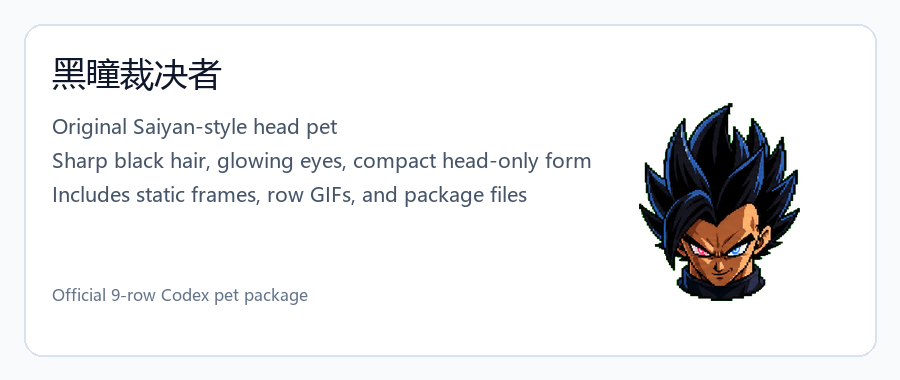
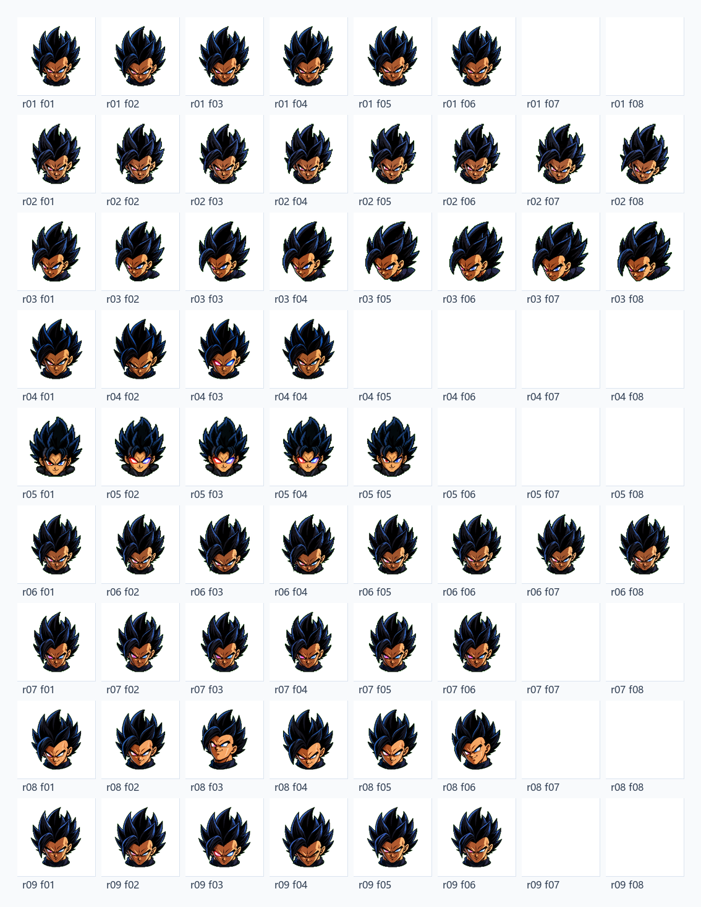

# 黑瞳裁决者

`黑瞳裁决者` is a real Codex desktop pet package loaded from the local Codex pets folder and copied into this repository as a finished example.

It contains the actual files a finished pet needs:

- `pet.json`
- `spritesheet.webp`

The sprite sheet follows the official Codex pet layout: 9 action rows x 8 frame columns.

## Preview



## Full Static Frames

The frame board below is generated from the real `spritesheet.webp` layout. It keeps the original 9 rows x 8 columns.



## Row Animations

These GIFs are generated row by row from the same sprite sheet. They preserve the official row order.

<p>
  
  
  
  
  
  
  
  
  
</p>

## Animation Showcase


## Pet Metadata

```json
{
  "id": "dark-judge",
  "displayName": "黑瞳裁决者",
  "spritesheetPath": "spritesheet.webp"
}
```

## What This Example Shows

- Head-only pets can still use all 9 official action rows.
- The motion reads through tilt, expression, bounce, glow, and hair movement.
- The row GIFs make compact head-form pets easier to evaluate before release.
