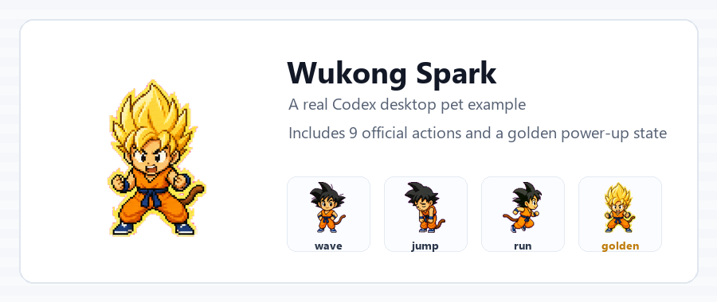
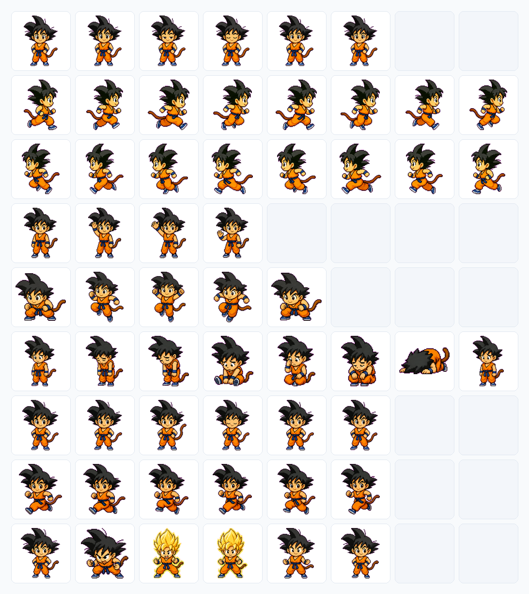
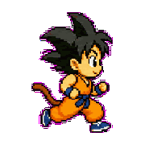
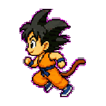
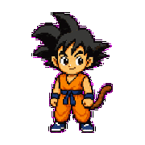
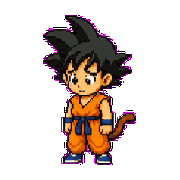
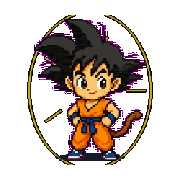
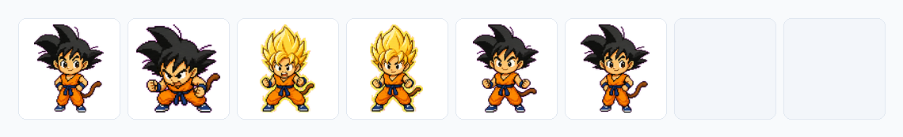

# Wukong Spark

`Wukong Spark` is a real Codex desktop pet package generated for this project and loaded by Codex Desktop.

It is useful as a GitHub showcase because it contains the actual files a finished pet needs:

- `pet.json`
- `spritesheet.webp`

The sprite sheet follows the official Codex pet layout: 9 actions x 8 frames.

## Preview



## Full Static Frames

The frame board below is copied from the real `spritesheet.webp` layout. It keeps the original 9 rows x 8 columns and does not rename the action rows.



## Row Animations

These GIFs are generated row by row from the same sprite sheet. They preserve the original row order.

<p>
  
  
  
  
  
  
  
  
  
</p>

## Animation Showcase


## Golden Power-Up

The sprite sheet also includes a temporary golden-hair power-up state.




## Pet Metadata

```json
{
  "id": "wukong-spark",
  "displayName": "Wukong Spark",
  "description": "A tiny original chibi martial-arts desktop pet with spiky black hair, orange training outfit, monkey tail, bouncing waves, and a temporary golden power-up animation.",
  "spritesheetPath": "spritesheet.webp"
}
```

## What This Example Shows

- A finished pet is small and portable.
- Codex reads `pet.json` and `spritesheet.webp`.
- The director workflow should help users lock the character first, then produce the 9 official action rows and any special frames inside those rows.
- README screenshots should show frames from the real production sprite sheet instead of hand-labeled action guesses.
