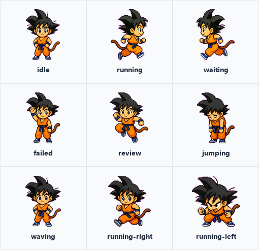

# Wukong Spark

`Wukong Spark` is a real Codex desktop pet package generated for this project and loaded by Codex Desktop.

It is useful as a GitHub showcase because it contains the actual files a finished pet needs:

- `pet.json`
- `spritesheet.webp`

The sprite sheet follows the official Codex pet layout: 9 actions x 8 frames.

## Preview


## Official Actions



## Animation Showcase


This GIF combines normal idle, golden power-up, running, jumping, and waving frames from the real sprite sheet.

## Golden Power-Up

The sprite sheet also includes a temporary golden-hair power-up state.


## Pet Metadata

```json
{
  "id": "wukong-spark",
  "displayName": "Wukong Spark",
  "description": "A tiny original chibi martial-arts desktop pet with spiky black hair, orange training outfit, monkey tail, bouncing waves, and a temporary golden power-up animation.",
  "spritesheetPath": "spritesheet.webp"
}
```

## What This Example Shows

- A finished pet is small and portable.
- Codex reads `pet.json` and `spritesheet.webp`.
- The director workflow should help users lock the character first, then produce the 9 official action rows and any special frames inside those rows.
- README screenshots can use generated preview assets, while the example folder keeps the real production file.
